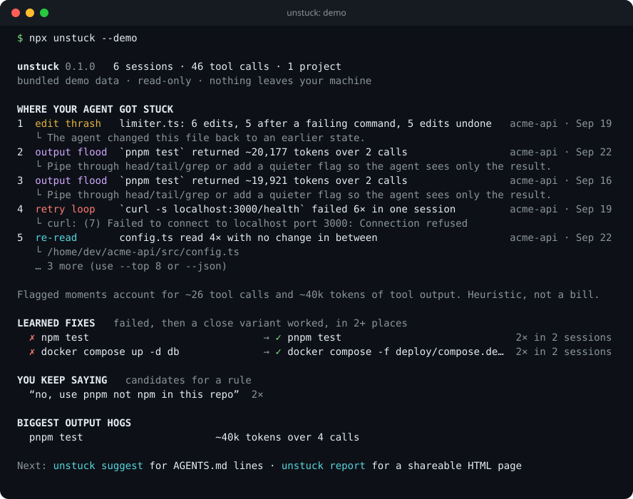
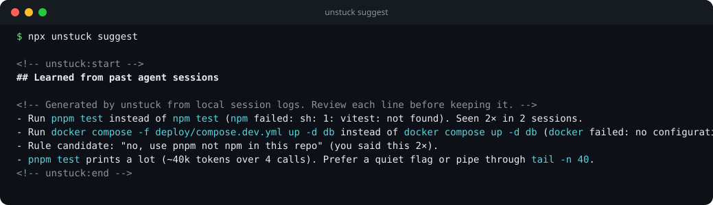
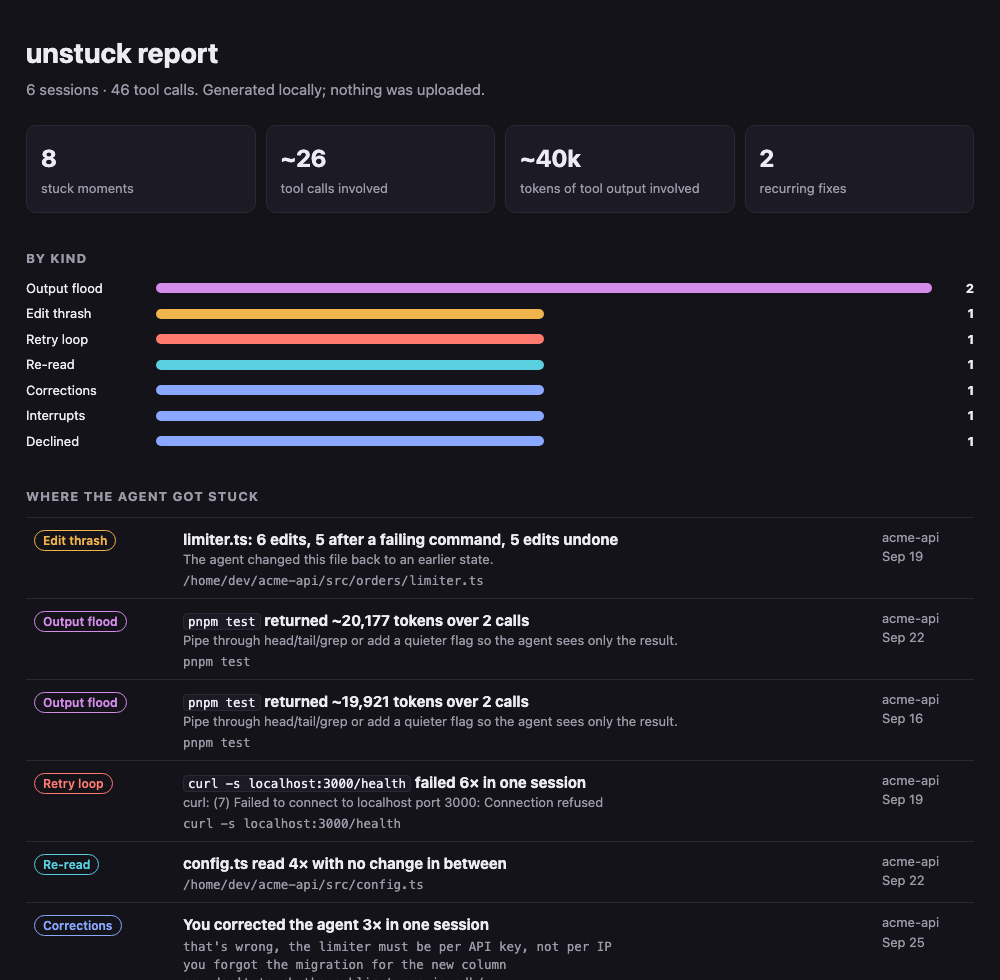

<h1 align="center">unstuck</h1>

<p align="center"><strong>Find where your coding agent got stuck, and turn the repeats into AGENTS.md lines.</strong></p>

<p align="center">
  <a href="https://github.com/Nithinfgs/unstuck/actions/workflows/ci.yml"></a>
  <a href="LICENSE"></a>
  
  
  
</p>

<p align="center">
  
</p>

```bash
npx github:Nithinfgs/unstuck --demo     # 5 seconds, bundled sample data, nothing to configure
npx github:Nithinfgs/unstuck            # your own Claude Code sessions from the last 30 days
```

## The 20-second version

Your agent already writes a full log of every session to disk. `unstuck` reads those
logs and answers the question cost dashboards don't: **where did the agent go in circles,
and will it do it again tomorrow?**

- A command failed five times in a row. An edit was applied, undone, applied, undone.
  A test run dumped 20k tokens into the context. The same file was re-read four times.
- You typed *"no, use pnpm not npm"* in more than one session.
- `npm test` failed, then `pnpm test` worked, again and again across sessions.

The last two are the useful part. `unstuck suggest` turns things that **recurred across
sessions** into lines you can put in `AGENTS.md` / `CLAUDE.md`, each with its evidence,
so the agent stops rediscovering them:

<p align="center">
  
</p>

Everything runs locally, offline, with no LLM. It only reads files.

## Why this exists

Agent logs are a record of every mistake your setup keeps making. Usage tools such as
[ccusage](https://github.com/ccusage/ccusage) are great at telling you *how much* you
spent. They don't tell you *why* the agent needed 14 edits to one file, or that the
instruction that would have prevented it is missing from your context file.

Context files tend to be written once, from memory. `unstuck` writes the next draft from
evidence.

## Quick start

Requires Node 20+. No install step, no dependencies.

```bash
# Summary of the last 30 days across all projects
npx github:Nithinfgs/unstuck

# One project, last two weeks
npx github:Nithinfgs/unstuck --project my-api --since 14d

# Lines to paste into AGENTS.md / CLAUDE.md (review before keeping them)
npx github:Nithinfgs/unstuck suggest

# ...or insert/update them in place (idempotent, between marker comments)
npx github:Nithinfgs/unstuck suggest --append AGENTS.md

# Shareable, self-contained HTML page (no scripts, loads nothing)
npx github:Nithinfgs/unstuck report -o unstuck-report.html
```

Prefer a global command? `npm i -g github:Nithinfgs/unstuck` gives you `unstuck`.

<p align="center">
  
</p>

## What it detects

| Finding | What it means | Why it's flagged |
| --- | --- | --- |
| **retry loop** | The same command failed 3+ times in one session | Usually a missing precondition (server not running, wrong tool) |
| **flailing** | 4+ different tool calls failed in a row | The agent was guessing |
| **edit thrash** | A file edited, a command failed, edited again (4+ times), or edits that undo earlier edits | The fix wasn't landing |
| **re-read** | The same unchanged file read 3+ times | Wasted context; the agent lost track |
| **output flood** | A tool result over ~30k characters (~7k tokens) | One command can dominate the context window |
| **corrections** | 3+ user messages that correct the agent in one session | A missing instruction |
| **interrupts** | You interrupted the agent 3+ times | It was heading the wrong way |
| **declined** | You rejected the same kind of command 2+ times | It keeps proposing what you won't allow |

Across sessions it also finds **learned fixes** (a command fails, a close variant works,
seen at least twice), **repeated corrections**, **output hogs**, and **files re-discovered in
most sessions**.

Detection is heuristic. Thresholds are deliberately conservative: a noisy detector gets
ignored. If a finding is wrong, please [open an issue](https://github.com/Nithinfgs/unstuck/issues/new?template=false-positive.yml).

## How it works

```
~/.claude/projects/**/*.jsonl
        │  stream line by line (no full-file loads, tool output is never stored)
        ▼
   adapters/        Claude Code · generic "unstuck JSONL"      → normalized Session
        ▼
   detect/          retry · thrash · rereads · floods · corrections · rejections
        ▼                                                       → Finding[] per session
   aggregate.js     learned fixes · repeated corrections · hot files · output hogs
        ▼
   render/          terminal · HTML · JSON · AGENTS.md block
```

- **Normalized model.** Each tool call becomes `{tool, kind, command|path, ok, rejected, outChars}`.
  Detectors never see raw log formats, so adding an agent means writing one adapter.
- **Signatures.** Shell commands are normalized (`cd x &&` prefixes, `2>&1`, `| tail -n`
  removed, long numbers collapsed) so retries group together.
- **Learned fixes.** When a command fails and a *similar but different* command succeeds
  within the next six shell calls, that pair is recorded. Pairs seen twice or more become
  suggestions. Plain retries of the identical command are ignored.
- **Ranking.** Findings are ordered by a rough impact score (wasted calls + output tokens).
  It orders the list; it is not a bill. Token figures assume 4 characters ≈ 1 token.

## Privacy

- Reads only. It never writes to your logs and makes **no network calls**.
- Tool output is counted, never stored. Only short excerpts of commands and error lines
  appear in output.
- Common secret shapes (API keys, GitHub/Slack/AWS tokens, JWTs, `Bearer …`, `password=…`)
  are masked and your home directory is shortened to `~`. This is pattern-based and
  best-effort, so **look at a report before you share it**. See [SECURITY.md](SECURITY.md).

## Supported agents

| Agent | Status |
| --- | --- |
| Claude Code (`~/.claude/projects`, or `$CLAUDE_CONFIG_DIR`) | Supported |
| Anything else | Convert to the tiny [unstuck JSONL](docs/adapters.md) format, or write an adapter |
| Codex CLI, OpenCode, Gemini CLI, Aider | Wanted. See [CONTRIBUTING.md](CONTRIBUTING.md) |

Session formats change between agent versions. If a Claude Code release breaks parsing,
that's a bug worth reporting.

## Options

```
unstuck [scan|suggest|report] [options]

  --demo              Use the bundled sample sessions
  --path <dir|file>   Transcript location (repeatable)
  --since <window>    30d (default), 12h, 2w or 2026-09-01
  --project <text>    Only sessions whose project path contains <text>
  --top <n>           Findings to list (default 8)
  --json              Machine-readable output
  -o, --out <file>    Output file for `report`
  --append <file>     For `suggest`: insert/update the block in a markdown file
  --no-color          Also honors NO_COLOR
```

Exit codes: `0` success, `1` nothing to read / path missing, `2` bad arguments.

## Roadmap

- [ ] Codex CLI and OpenCode adapters
- [ ] Per-project config for thresholds (`.unstuckrc`)
- [ ] `unstuck watch`: flag a loop while it is happening
- [ ] Detect instructions in AGENTS.md that the agent repeatedly ignores
- [ ] GitHub Action that comments learned fixes on a PR

## Contributing

Adapters and false-positive reports are the most useful contributions. Start with
[CONTRIBUTING.md](CONTRIBUTING.md); `npm run check` runs lint, type checks and the test
suite. Be kind: see the [Code of Conduct](CODE_OF_CONDUCT.md).

The bundled demo sessions are synthetic (generated by [`scripts/make-demo.js`](scripts/make-demo.js)
for a fictional `acme-api` project), not real user data.

## License

[MIT](LICENSE)
